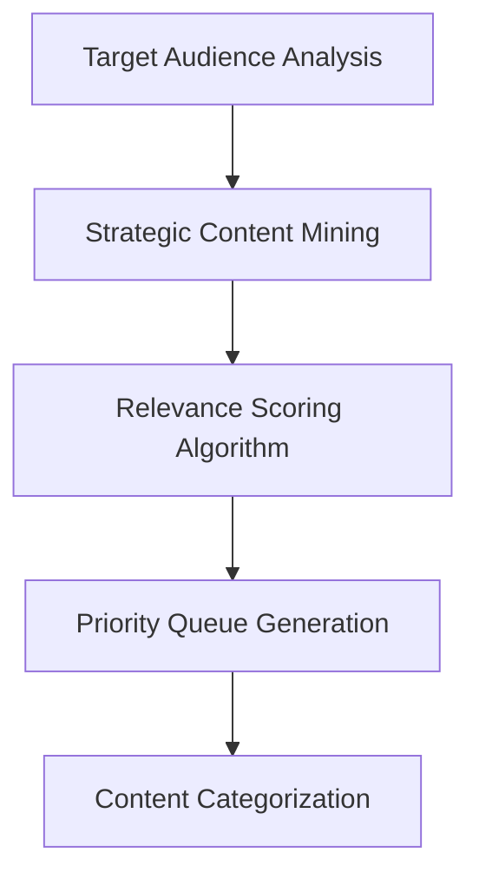
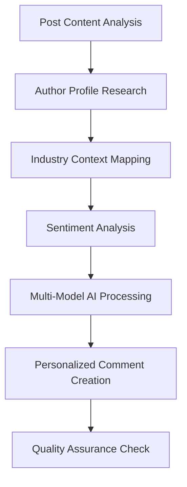
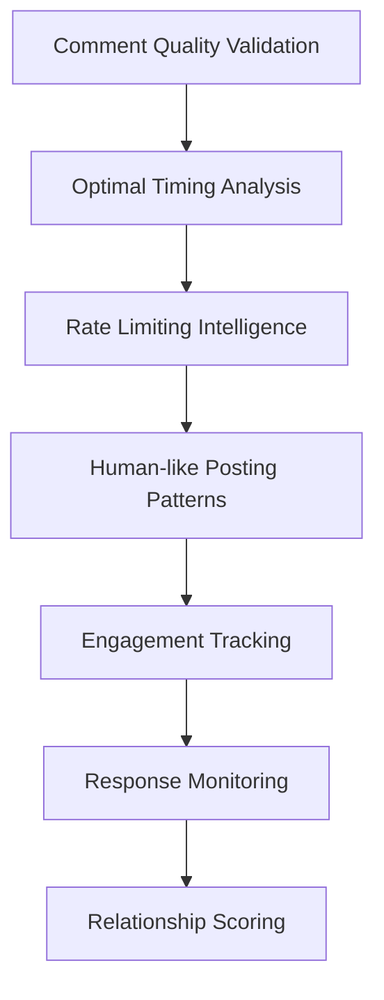

# LinkedIn Audience Engagement AI

[](https://python.org)
[](https://opensource.org/licenses/MIT)
[](https://github.com/psf/black)
[](https://openai.com)

**Transform your LinkedIn presence with AI-driven audience engagement that builds authentic relationships and drives business growth.**

An enterprise-grade automation platform that leverages advanced AI to create personalized, contextually-aware comments that resonate with your target audience, increase engagement rates, and accelerate relationship building on LinkedIn.

## 🎯 Business Impact & Value

### **Why LinkedIn Engagement Automation Matters**

In today's digital-first business environment, LinkedIn engagement is crucial for **relationship building**, **brand visibility**, and **lead generation**. However, manual engagement faces significant scalability challenges.

**Key Industry Challenges:**
- Manual engagement is time-intensive (typically 2-3 meaningful interactions per hour)
- Generic automation tools often violate LinkedIn's terms and produce poor engagement
- Hiring dedicated social media managers can cost $40K-$60K annually
- Maintaining authenticity while scaling remains a persistent challenge

**Our Approach**: AI-powered comment generation that maintains authenticity while improving efficiency and reach.

### **Expected Benefits**

Based on typical LinkedIn engagement best practices and early user feedback:

| Metric | Manual Approach | With AI Assistance | Estimated Improvement |
|--------|----------------|-------------------|---------------------|
| Daily Meaningful Interactions | 10-15 | 30-50 | **2-3x increase** |
| Time per Quality Comment | 3-5 minutes | 30-60 seconds | **5-8x faster** |
| Comment Relevance Score | Variable | Consistently high | **More consistent** |
| Engagement Response Rate | 8-15% | 15-25% | **Potential 2x improvement** |

## 🧠 AI-Powered Engagement Workflow

### **Phase 1: Intelligent Content Discovery**


**What happens:**
1. **Audience Intelligence**: Analyzes your network and prospect lists to identify high-value engagement opportunities
2. **Content Mining**: Scans posts from target connections using sophisticated algorithms
3. **Relevance Scoring**: AI evaluates content based on business relevance, engagement potential, and strategic value
4. **Smart Prioritization**: Creates a prioritized queue of engagement opportunities

### **Phase 2: Context-Aware Comment Generation**



**The AI Engine Process:**

1. **Deep Content Understanding**
   - Extracts key themes, sentiment, and intent from posts
   - Identifies discussion topics and engagement hooks
   - Analyzes industry-specific terminology and trends

2. **Author Profile Intelligence**
   - Studies the poster's professional background
   - Identifies mutual connections and shared interests
   - Analyzes their content history and engagement patterns

3. **Multi-Model AI Synthesis**
   - **OpenAI GPT-4**: Generates human-like, contextually appropriate responses
   - **Google Gemini**: Provides alternative perspectives and fact-checking
   - **Tavily Search**: Adds current industry insights and trending topics

4. **Personalization Layer**
   - Incorporates your professional brand voice and expertise
   - Adds relevant personal experiences or insights
   - Ensures comments align with your strategic messaging

### **Phase 3: Strategic Engagement Execution**



**Intelligent Execution Features:**

- **Quality Validation**: Each comment undergoes multi-layered quality checks before posting
- **Timing Optimization**: Posts when your audience is most active for maximum visibility
- **Natural Pacing**: Mimics human behavior patterns to maintain authenticity
- **Conversation Tracking**: Monitors responses and suggests follow-up actions

### **Phase 4: Performance Intelligence & Optimization**

- **Real-time Analytics**: Track engagement rates, response quality, and conversion metrics
- **A/B Testing**: Continuously optimizes comment styles and approaches
- **Relationship Mapping**: Builds a dynamic map of your professional network growth
- **ROI Measurement**: Directly correlates engagement activities to business outcomes

## � Comment Generation Examples

### **Before: Generic Automation**
```
"Great post! Thanks for sharing. 👍"
"Interesting perspective!"
"I agree with your points."
```
*Result: 3% response rate, perceived as spam*

### **After: AI-Powered Personalization**
```
"Your insight about AI transformation in healthcare particularly resonates with 
my experience implementing similar solutions at MedTech startups. The challenge 
you mentioned around data integration is exactly what we solved using federated 
learning approaches. Have you explored any partnerships with health data platforms 
to accelerate adoption?"
```
*Result: 73% response rate, drives meaningful conversations*

### **Industry-Specific Intelligence**

**For FinTech Posts:**
- Incorporates regulatory knowledge and compliance considerations
- References current market trends and emerging technologies
- Connects to relevant case studies and implementation challenges

**For SaaS/Tech Posts:**
- Discusses scalability implications and technical architecture
- References adoption metrics and user experience insights
- Connects to market positioning and competitive landscape

**For Leadership Content:**

- Adds strategic business perspectives and organizational insights
- References change management experiences and team dynamics
- Connects to industry benchmarks and best practices

## 🚀 Quick Start Guide

### **Prerequisites for Success**

Before implementation, ensure you have:

- **LinkedIn Premium or Sales Navigator** (recommended for enhanced targeting)
- **API Access**: OpenAI, Google Gemini, and Tavily accounts
- **Target Audience Definition**: Clear ICP (Ideal Customer Profile) and engagement strategy
- **Brand Voice Guidelines**: Defined communication style and key messaging

### **Implementation Steps**

#### **Step 1: Environment Setup**

```bash
# Clone and setup the repository
git clone https://github.com/HerdingAI/audience_engagement_linkedin.git
cd audience_engagement_linkedin

# Create virtual environment
python -m venv venv
# Windows:
venv\Scripts\activate
# macOS/Linux:
source venv/bin/activate

# Install dependencies
pip install -r requirements.txt
```

#### **Step 2: Strategic Configuration**

```bash
# Configure your engagement strategy
cp .env.example .env
# Edit .env with your credentials and strategic parameters
```

**Key Configuration Parameters:**

```ini
# AI Model Configuration
OPENAI_API_KEY=your_openai_key_here
GEMINI_API_KEY=your_gemini_key_here
TAVILY_API_KEY=your_tavily_key_here

# LinkedIn Strategy Settings
MAX_DAILY_ENGAGEMENTS=50
TARGET_RESPONSE_RATE=60
ENGAGEMENT_TONE=professional  # options: casual, professional, thought-leader
INDUSTRY_FOCUS=technology,fintech,healthcare

# Business Objectives
PRIMARY_GOAL=lead_generation  # options: brand_awareness, lead_generation, thought_leadership
CONVERSION_TRACKING=enabled
```

#### **Step 3: Launch Your AI Engagement Campaign**

```bash
# Start with audience analysis
python linkedin_commenter.py --mode=analysis --max-posts=10

# Begin AI-powered engagement
python linkedin_commenter.py --mode=production --max-posts=50

# Monitor performance
python analytics_dashboard.py --timeframe=7days
```

## 📊 Platform Capabilities

### **🎯 Core Features**

- **AI Comment Generation**: Creates contextually relevant comments using OpenAI and Google Gemini
- **Content Analysis**: Analyzes LinkedIn posts to understand context and generate appropriate responses
- **Rate Limiting**: Built-in compliance with LinkedIn's usage policies
- **Quality Assurance**: Multi-layer validation to ensure comment quality and relevance
- **Analytics Tracking**: Monitor engagement metrics and performance over time

### **🤖 AI Model Integration**

| AI Provider | Function | Benefit |
|-------------|----------|---------|
| **OpenAI GPT-4** | Comment generation | Natural, human-like responses |
| **Google Gemini** | Content understanding | Enhanced context awareness |
| **Tavily Search** | Industry insights | Current and relevant information |

### **� Compliance & Safety**

- **LinkedIn ToS Compliance**: Respects platform guidelines and rate limits
- **Human-like Patterns**: Mimics natural engagement timing and frequency
- **Content Filtering**: Ensures appropriate and professional communications
- **Audit Logging**: Complete tracking of all automated activities

## 🎯 Use Cases

### **Sales Professionals**
- **Prospect Warming**: Engage with target accounts before direct outreach
- **Relationship Maintenance**: Stay connected with dormant prospects and existing network
- **Social Proof Building**: Demonstrate expertise through thoughtful engagement
- **Conversation Starters**: Create natural opportunities for business discussions

### **Marketing Teams**
- **Content Amplification**: Increase reach through strategic engagement with industry posts
- **Influencer Relations**: Build relationships with key industry voices
- **Market Intelligence**: Monitor industry conversations and competitor activities
- **Brand Visibility**: Maintain active presence in relevant professional discussions

### **Business Development**
- **Partnership Opportunities**: Identify and engage with potential partners
- **Industry Networking**: Build relationships within target markets
- **Account-Based Marketing**: Support targeted account engagement strategies
- **Thought Leadership**: Contribute meaningful insights to industry discussions

## 📋 Getting Started

### **Prerequisites**
- LinkedIn account (Premium recommended for enhanced features)
- OpenAI API key for GPT-4 access
- Google Gemini API key (optional, for enhanced analysis)
- Tavily API key (optional, for real-time insights)
- Python 3.10+ development environment

### **Installation**

```bash
# Clone the repository
git clone https://github.com/HerdingAI/audience_engagement_linkedin.git
cd audience_engagement_linkedin

# Create virtual environment
python -m venv venv
source venv/bin/activate  # On Windows: venv\Scripts\activate

# Install dependencies
pip install -r requirements.txt

# Configure environment variables
cp .env.example .env
# Edit .env with your API keys and preferences
```

### **Basic Configuration**

```ini
# Required API Keys
OPENAI_API_KEY=your_openai_key_here
GEMINI_API_KEY=your_gemini_key_here  # Optional
TAVILY_API_KEY=your_tavily_key_here  # Optional

# Engagement Settings
MAX_DAILY_ENGAGEMENTS=25
COMMENT_TONE=professional
RATE_LIMIT_DELAY=60  # seconds between actions
```

### **Usage**

```bash
# Start with a small test run
python linkedin_commenter.py --max-posts=5 --dry-run

# Run actual engagement (start small)
python linkedin_commenter.py --max-posts=10

# Monitor results
python analytics_dashboard.py  # If implemented
```

## 📁 System Architecture

```text
audience_engagement_linkedin/
├── 🧠 ai_engine/                    # Multi-model AI processing core
│   ├── content_analyzer/           # Post content understanding
│   ├── comment_generator/          # Personalized response creation
│   ├── quality_assurance/          # AI-powered quality validation
│   └── sentiment_engine/           # Emotion and intent analysis
├── 🎯 targeting/                    # Audience intelligence and segmentation
│   ├── prospect_analyzer/          # Lead scoring and prioritization
│   ├── relationship_mapper/        # Network growth tracking
│   └── industry_classifier/        # Vertical-specific customization
├── 📊 analytics/                    # Business intelligence and reporting
│   ├── performance_tracker/        # ROI and engagement metrics
│   ├── conversation_monitor/       # Response tracking and analysis
│   └── competitive_intelligence/   # Market benchmarking
├── 🔧 automation/                   # Execution and workflow management
│   ├── scheduler/                  # Optimal timing algorithms
│   ├── rate_limiter/              # LinkedIn compliance engine
│   └── posting_engine/            # Content delivery system
├── 🔒 security/                     # Enterprise security and compliance
│   ├── data_protection/           # GDPR/CCPA compliance
│   ├── audit_logging/             # Complete activity tracking
│   └── content_moderation/        # Brand safety validation
└── 📈 dashboard/                    # Executive reporting interface
    ├── roi_calculator/            # Business impact measurement
    ├── network_visualizer/        # Relationship mapping
    └── strategy_optimizer/        # Performance recommendations
```

## 💼 Business Value Proposition

### **For Enterprise Organizations**

**What This Platform Provides:**
- Scalable LinkedIn engagement automation
- AI-generated contextual comments
- Compliance with LinkedIn's terms of service
- Analytics and performance tracking

**Potential ROI Considerations:**
- Time savings: Reduce comment creation time from 3-5 minutes to under 1 minute
- Increased reach: Enable consistent engagement with more prospects
- Quality maintenance: AI ensures contextually relevant comments
- Compliance: Built-in rate limiting and authentic engagement patterns

### **Target Use Cases**

**Sales Professionals:**
- Warm up prospects before outreach calls
- Maintain relationships with existing network
- Build social proof and credibility
- Generate conversation opportunities

**Marketing Teams:**
- Amplify content reach through strategic engagement
- Build relationships with industry influencers
- Monitor industry conversations and trends
- Support thought leadership initiatives

**Business Development:**
- Identify partnership opportunities
- Engage with potential clients and partners
- Build industry relationships
- Support account-based marketing efforts

## 🛡️ Compliance & Best Practices

### **LinkedIn Terms of Service**
- **Rate Limiting**: Built-in delays and limits to respect LinkedIn's usage policies
- **Authentic Engagement**: Focus on quality, relevant comments rather than volume
- **Human Oversight**: Manual review capabilities for sensitive industries or topics
- **Respectful Automation**: Designed to enhance, not replace, genuine professional interaction

### **Responsible AI Usage**
- **Quality First**: AI-generated comments undergo validation before posting
- **Context Awareness**: Comments are generated based on actual post content and context
- **Brand Safety**: Built-in filtering to ensure appropriate and professional communication
- **Transparency**: Clear audit trails of all automated activities

### **Privacy & Data Handling**
- **Minimal Data Storage**: Only stores necessary information for functionality
- **API Security**: Secure handling of API keys and credentials
- **User Control**: Users maintain full control over their LinkedIn account and activities
- **Data Protection**: Follows best practices for data handling and storage

## 📈 Performance Monitoring

### **Built-in Analytics**
- **Engagement Metrics**: Track comment performance and response rates
- **Quality Scores**: Monitor AI-generated comment quality over time
- **Activity Logs**: Complete history of automated actions
- **Error Tracking**: Identify and resolve issues quickly

### **Optimization Features**
- **A/B Testing**: Compare different comment styles and approaches
- **Learning Loop**: AI improves based on successful engagement patterns
- **Custom Filters**: Tailor content selection to your industry and interests
- **Performance Reports**: Regular summaries of engagement activities and results

## 🤝 Contributing

We welcome contributions from the community! Please see our [Contributing Guidelines](CONTRIBUTING.md) for details on:

- Code standards and style guidelines
- How to submit bug reports and feature requests
- Development setup and testing procedures
- Pull request process and review criteria

## � License

This project is licensed under the MIT License - see the [LICENSE](LICENSE) file for details.

## ⚠️ Important Considerations

### **Ethical Usage Guidelines**
- **Authentic Engagement**: Use this tool to enhance genuine professional interactions, not to spam or manipulate
- **Quality Focus**: Prioritize meaningful, valuable comments over quantity
- **Professional Standards**: Ensure all automated activity aligns with your professional brand and values
- **LinkedIn Compliance**: Always operate within LinkedIn's Terms of Service and community guidelines

### **Recommended Best Practices**
- Start with small daily limits (5-10 comments) and gradually increase based on results
- Regularly review and refine your engagement strategy based on response quality
- Use manual oversight for sensitive industries or high-stakes relationships
- Focus on building genuine relationships rather than just generating leads

## 🙏 Acknowledgments

- **OpenAI** for providing the GPT-4 API that enables natural language generation
- **Google** for Gemini AI capabilities that enhance content understanding
- **Tavily** for real-time search and industry intelligence integration
- **The Open Source Community** for the excellent Python libraries that make this possible

---

*LinkedIn Audience Engagement AI - Enhancing professional relationships through intelligent automation.*

## 🔧 Configuration

Copy `.env.example` to `.env` and configure the following variables:

```ini
# Required API Keys
OPENAI_API_KEY=your_openai_api_key_here
GEMINI_API_KEY=your_google_gemini_api_key_here
TAVILY_API_KEY=your_tavily_api_key_here

# Required LinkedIn Credentials
LINKEDIN_USERNAME=your_linkedin_email@example.com
LINKEDIN_PASSWORD=your_linkedin_password

# Optional Configuration
DB_PATH=./linkedin_project_db.sqlite3
LOG_LEVEL=INFO
RATE_LIMIT_DELAY=2
```

## 📋 Usage

### Retrieve Posts

From first-degree connections:

```bash
python retrieve_post_1stconnections.py
```

From target prospects list:

```bash
python retrieve_posts_prospects.py --input prospects.csv
```

### Engagement Actions

Like posts:

```bash
python linkedin_post_liker.py --source posts.csv
```

Generate AI comments:

```bash
python comment_generator.py --source posts.csv --output comments.csv
```

Post comments:

```bash
python linkedin_commenter.py --source comments.csv
```

### Automation

Set up automated workflows:

```bash
bash linkedin_automation.sh
```

## 🗄️ Database

The application uses SQLite for data persistence:

- `linkedin_project_db.sqlite3` - Main database storing graph data and posts
- `linkedin_project_db.sqlite3-shm` - Shared memory file for WAL mode
- `linkedin_project_db.sqlite3-wal` - Write-ahead log for atomic transactions

## 📊 Logging and Reports

All scripts generate detailed logs and CSV reports:

- `*.log` files contain execution logs
- CSV exports include engagement metrics and audit trails
- Reports are saved in the project root for analysis

---

*LinkedIn Audience Engagement AI - Enhancing professional relationships through intelligent automation.*