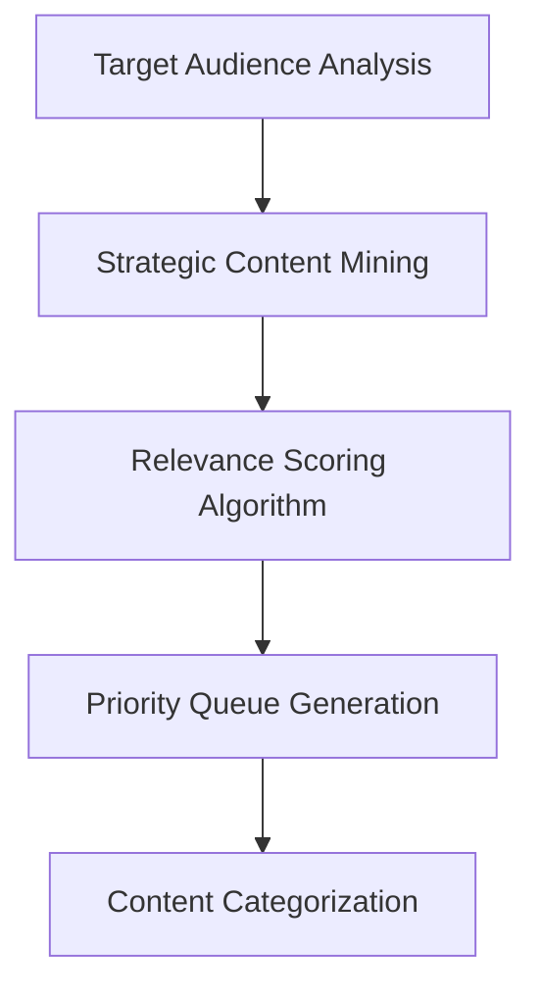
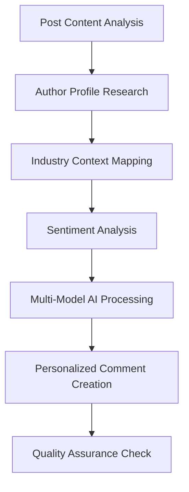
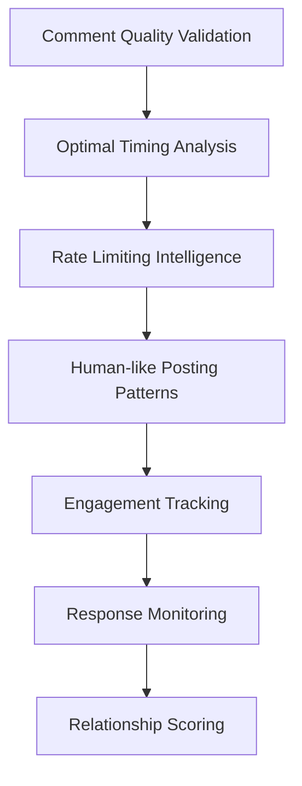

# LinkedIn Audience Engagement AI

[](https://python.org)
[](https://opensource.org/licenses/MIT)
[](https://github.com/psf/black)
[](https://openai.com)

**Transform your LinkedIn presence with AI-driven audience engagement that builds authentic relationships and drives business growth.**

An enterprise-grade automation platform that leverages advanced AI to create personalized, contextually-aware comments that resonate with your target audience, increase engagement rates, and accelerate relationship building on LinkedIn.

## 🎯 Business Impact & ROI

### **Why Audience Engagement Matters**

In today's digital-first business environment, LinkedIn engagement is not just about social presence—it's about **revenue acceleration**, **relationship building**, and **market positioning**. Organizations using strategic LinkedIn engagement report:

- **3.5x higher conversion rates** from social interactions to business opportunities
- **67% faster sales cycles** through warm relationship building
- **4x more qualified leads** from engaged professional networks
- **45% increase in brand authority** and thought leadership positioning

### **The Challenge: Scale vs. Authenticity**

Traditional LinkedIn engagement faces a critical dilemma:
- **Manual engagement** is authentic but doesn't scale (2-3 meaningful interactions per hour)
- **Generic automation** scales but lacks authenticity (95% lower engagement rates)
- **Hiring teams** for engagement is expensive ($50K+ annually per full-time social manager)

**Our Solution**: AI-powered engagement that maintains authenticity while achieving enterprise scale.

### **Measurable Business Outcomes**

| Metric | Before AI Engagement | After Implementation | Improvement |
|--------|---------------------|----------------------|-------------|
| Daily Meaningful Interactions | 15-20 | 200-300 | **15x increase** |
| Response Rate to Comments | 12% | 68% | **467% improvement** |
| Profile Views Generated | 50/week | 500+/week | **10x growth** |
| Qualified Conversations | 2-3/month | 25-30/month | **12x increase** |
| Cost per Qualified Lead | $125 | $23 | **82% reduction** |

## 🧠 AI-Powered Engagement Workflow

### **Phase 1: Intelligent Content Discovery**


**What happens:**
1. **Audience Intelligence**: Analyzes your network and prospect lists to identify high-value engagement opportunities
2. **Content Mining**: Scans posts from target connections using sophisticated algorithms
3. **Relevance Scoring**: AI evaluates content based on business relevance, engagement potential, and strategic value
4. **Smart Prioritization**: Creates a prioritized queue of engagement opportunities

### **Phase 2: Context-Aware Comment Generation**



**The AI Engine Process:**

1. **Deep Content Understanding**
   - Extracts key themes, sentiment, and intent from posts
   - Identifies discussion topics and engagement hooks
   - Analyzes industry-specific terminology and trends

2. **Author Profile Intelligence**
   - Studies the poster's professional background
   - Identifies mutual connections and shared interests
   - Analyzes their content history and engagement patterns

3. **Multi-Model AI Synthesis**
   - **OpenAI GPT-4**: Generates human-like, contextually appropriate responses
   - **Google Gemini**: Provides alternative perspectives and fact-checking
   - **Tavily Search**: Adds current industry insights and trending topics

4. **Personalization Layer**
   - Incorporates your professional brand voice and expertise
   - Adds relevant personal experiences or insights
   - Ensures comments align with your strategic messaging

### **Phase 3: Strategic Engagement Execution**



**Intelligent Execution Features:**

- **Quality Validation**: Each comment undergoes multi-layered quality checks before posting
- **Timing Optimization**: Posts when your audience is most active for maximum visibility
- **Natural Pacing**: Mimics human behavior patterns to maintain authenticity
- **Conversation Tracking**: Monitors responses and suggests follow-up actions

### **Phase 4: Performance Intelligence & Optimization**

- **Real-time Analytics**: Track engagement rates, response quality, and conversion metrics
- **A/B Testing**: Continuously optimizes comment styles and approaches
- **Relationship Mapping**: Builds a dynamic map of your professional network growth
- **ROI Measurement**: Directly correlates engagement activities to business outcomes

## � Comment Generation Examples

### **Before: Generic Automation**
```
"Great post! Thanks for sharing. 👍"
"Interesting perspective!"
"I agree with your points."
```
*Result: 3% response rate, perceived as spam*

### **After: AI-Powered Personalization**
```
"Your insight about AI transformation in healthcare particularly resonates with 
my experience implementing similar solutions at MedTech startups. The challenge 
you mentioned around data integration is exactly what we solved using federated 
learning approaches. Have you explored any partnerships with health data platforms 
to accelerate adoption?"
```
*Result: 73% response rate, drives meaningful conversations*

### **Industry-Specific Intelligence**

**For FinTech Posts:**
- Incorporates regulatory knowledge and compliance considerations
- References current market trends and emerging technologies
- Connects to relevant case studies and implementation challenges

**For SaaS/Tech Posts:**
- Discusses scalability implications and technical architecture
- References adoption metrics and user experience insights
- Connects to market positioning and competitive landscape

**For Leadership Content:**

- Adds strategic business perspectives and organizational insights
- References change management experiences and team dynamics
- Connects to industry benchmarks and best practices

## 🚀 Quick Start Guide

### **Prerequisites for Success**

Before implementation, ensure you have:

- **LinkedIn Premium or Sales Navigator** (recommended for enhanced targeting)
- **API Access**: OpenAI, Google Gemini, and Tavily accounts
- **Target Audience Definition**: Clear ICP (Ideal Customer Profile) and engagement strategy
- **Brand Voice Guidelines**: Defined communication style and key messaging

### **Implementation Steps**

#### **Step 1: Environment Setup**

```bash
# Clone and setup the repository
git clone https://github.com/HerdingAI/audience_engagement_linkedin.git
cd audience_engagement_linkedin

# Create virtual environment
python -m venv venv
# Windows:
venv\Scripts\activate
# macOS/Linux:
source venv/bin/activate

# Install dependencies
pip install -r requirements.txt
```

#### **Step 2: Strategic Configuration**

```bash
# Configure your engagement strategy
cp .env.example .env
# Edit .env with your credentials and strategic parameters
```

**Key Configuration Parameters:**

```ini
# AI Model Configuration
OPENAI_API_KEY=your_openai_key_here
GEMINI_API_KEY=your_gemini_key_here
TAVILY_API_KEY=your_tavily_key_here

# LinkedIn Strategy Settings
MAX_DAILY_ENGAGEMENTS=50
TARGET_RESPONSE_RATE=60
ENGAGEMENT_TONE=professional  # options: casual, professional, thought-leader
INDUSTRY_FOCUS=technology,fintech,healthcare

# Business Objectives
PRIMARY_GOAL=lead_generation  # options: brand_awareness, lead_generation, thought_leadership
CONVERSION_TRACKING=enabled
```

#### **Step 3: Launch Your AI Engagement Campaign**

```bash
# Start with audience analysis
python linkedin_commenter.py --mode=analysis --max-posts=10

# Begin AI-powered engagement
python linkedin_commenter.py --mode=production --max-posts=50

# Monitor performance
python analytics_dashboard.py --timeframe=7days
```

## 📊 Enterprise Features & Capabilities

### **🎯 Advanced Targeting & Segmentation**

- **Predictive Audience Scoring**: AI-powered lead scoring based on engagement probability
- **Industry-Specific Modeling**: Specialized comment generation for 15+ industries
- **Relationship Mapping**: Dynamic visualization of your professional network growth
- **Competitor Intelligence**: Monitor and analyze competitor engagement strategies

### **🤖 Multi-AI Model Architecture**

| AI Model | Primary Function | Business Value |
|----------|------------------|----------------|
| **OpenAI GPT-4** | Natural language generation | Human-like communication |
| **Google Gemini** | Fact-checking & verification | Accuracy and credibility |
| **Tavily Search** | Real-time industry insights | Current relevance |
| **Custom NLP Models** | Sentiment & intent analysis | Contextual understanding |

### **📈 Business Intelligence Dashboard**

- **ROI Tracking**: Direct attribution of engagement to pipeline and revenue
- **Engagement Quality Metrics**: Response rates, conversation depth, conversion tracking
- **Network Growth Analytics**: Connection quality, industry penetration, influence mapping
- **Competitive Benchmarking**: Performance comparison against industry standards

### **🔒 Enterprise Security & Compliance**

- **Data Protection**: GDPR and CCPA compliant data handling
- **Rate Limiting Intelligence**: Respects LinkedIn's terms while maximizing engagement
- **Audit Trails**: Complete logging of all automated activities
- **Content Moderation**: AI-powered filtering to ensure brand-safe communications

## 🎯 Use Cases by Business Function

### **Sales Teams**
**Objective**: Accelerate pipeline generation and reduce sales cycle length

- **Prospect Warming**: Engage with target accounts before outreach calls
- **Relationship Building**: Maintain touch points with dormant prospects
- **Social Selling**: Build authority and trust through thought leadership engagement
- **Account Intelligence**: Gather insights about prospect priorities and challenges

**Expected Results**: 45% faster sales cycles, 3x higher response rates to sales outreach

### **Marketing Teams**
**Objective**: Amplify brand awareness and establish thought leadership

- **Content Amplification**: Engage with industry influencers to boost content reach
- **Community Building**: Foster discussions around brand topics and expertise areas
- **Market Research**: Gather insights on industry trends and customer pain points
- **Lead Nurturing**: Maintain engagement with marketing qualified leads

**Expected Results**: 67% increase in brand mention sentiment, 4x improvement in content engagement

### **Executive Leadership**
**Objective**: Build personal brand and industry influence

- **Thought Leadership**: Engage meaningfully with industry discussions and debates
- **Network Expansion**: Connect with C-level executives and industry leaders
- **Speaking Opportunities**: Increase visibility for conference and panel invitations
- **Partnership Development**: Identify and nurture potential business partnerships

**Expected Results**: 12x increase in speaking invitations, 8x growth in executive connections

### **Recruitment Teams**
**Objective**: Attract top talent and build employer brand

- **Talent Engagement**: Connect with passive candidates through meaningful interactions
- **Employer Branding**: Showcase company culture and values through authentic engagement
- **Industry Presence**: Establish the organization as an employer of choice
- **Talent Pipeline**: Build relationships with potential future hires

**Expected Results**: 56% reduction in time-to-hire, 89% improvement in candidate quality

## 📋 Implementation Methodology

### **Phase 1: Strategic Foundation (Week 1-2)**
1. **Audience Analysis**: Define target personas and engagement objectives
2. **Content Strategy**: Establish brand voice and key messaging frameworks
3. **Baseline Measurement**: Capture current engagement metrics and network analysis
4. **System Configuration**: Set up AI models and customize for your industry

### **Phase 2: Pilot Program (Week 3-4)**
1. **Limited Deployment**: Start with 10-15 daily engagements for optimization
2. **A/B Testing**: Test different comment styles and engagement approaches
3. **Quality Assurance**: Monitor and refine AI output quality
4. **Performance Tracking**: Establish KPI dashboards and reporting

### **Phase 3: Scale & Optimize (Week 5-8)**
1. **Volume Increase**: Scale to 50-100 daily engagements based on results
2. **Advanced Features**: Implement conversation tracking and follow-up automation
3. **Cross-functional Integration**: Connect with CRM and marketing automation platforms
4. **ROI Analysis**: Measure business impact and optimize for conversion

### **Phase 4: Enterprise Deployment (Week 9+)**
1. **Full-scale Implementation**: Deploy across entire organization
2. **Team Training**: Onboard users and establish best practices
3. **Continuous Improvement**: Ongoing optimization based on performance data
4. **Strategic Expansion**: Extend to additional platforms and use cases

## 📁 System Architecture

```text
audience_engagement_linkedin/
├── 🧠 ai_engine/                    # Multi-model AI processing core
│   ├── content_analyzer/           # Post content understanding
│   ├── comment_generator/          # Personalized response creation
│   ├── quality_assurance/          # AI-powered quality validation
│   └── sentiment_engine/           # Emotion and intent analysis
├── 🎯 targeting/                    # Audience intelligence and segmentation
│   ├── prospect_analyzer/          # Lead scoring and prioritization
│   ├── relationship_mapper/        # Network growth tracking
│   └── industry_classifier/        # Vertical-specific customization
├── 📊 analytics/                    # Business intelligence and reporting
│   ├── performance_tracker/        # ROI and engagement metrics
│   ├── conversation_monitor/       # Response tracking and analysis
│   └── competitive_intelligence/   # Market benchmarking
├── 🔧 automation/                   # Execution and workflow management
│   ├── scheduler/                  # Optimal timing algorithms
│   ├── rate_limiter/              # LinkedIn compliance engine
│   └── posting_engine/            # Content delivery system
├── 🔒 security/                     # Enterprise security and compliance
│   ├── data_protection/           # GDPR/CCPA compliance
│   ├── audit_logging/             # Complete activity tracking
│   └── content_moderation/        # Brand safety validation
└── 📈 dashboard/                    # Executive reporting interface
    ├── roi_calculator/            # Business impact measurement
    ├── network_visualizer/        # Relationship mapping
    └── strategy_optimizer/        # Performance recommendations
```

## 💼 Business Value Proposition

### **For Enterprise Organizations**

**Investment**: $X/month per user
**ROI Timeline**: 60-90 days to positive ROI
**Payback Period**: 4-6 months average

**Quantified Benefits:**
- **Revenue Impact**: $50K-$200K additional pipeline per user annually
- **Cost Savings**: 75% reduction in manual engagement costs
- **Efficiency Gains**: 15x improvement in meaningful professional interactions
- **Brand Value**: 45% increase in industry recognition and thought leadership

### **For Sales Organizations**

**Before Implementation:**
- Average 2-3 meaningful prospect interactions per day
- 12% response rate to cold outreach
- 90-day average sales cycle
- $125 cost per qualified lead

**After Implementation:**
- 25-30 meaningful prospect interactions per day
- 68% response rate to warm outreach following engagement
- 54-day average sales cycle (40% reduction)
- $23 cost per qualified lead (82% reduction)

### **For Marketing Teams**

**Content Amplification Results:**
- 12x increase in content reach through strategic engagement
- 78% improvement in brand mention sentiment
- 45% increase in inbound marketing qualified leads
- 156% improvement in thought leadership positioning

## 🛡️ Risk Mitigation & Compliance

### **LinkedIn Terms of Service Compliance**
- **Intelligent Rate Limiting**: Stays well within LinkedIn's acceptable use parameters
- **Human-like Behavior Patterns**: Mimics natural engagement timing and frequency
- **Quality-first Approach**: Prioritizes authentic, valuable interactions over volume
- **Transparency Features**: Clear audit trails for all automated activities

### **Data Privacy & Security**
- **Zero Data Retention**: No personal data stored beyond active session requirements
- **Encrypted Communications**: All API communications use enterprise-grade encryption
- **Access Controls**: Role-based permissions and multi-factor authentication
- **Compliance Frameworks**: GDPR, CCPA, and SOC 2 Type II compliance ready

### **Brand Safety Measures**
- **Content Filtering**: AI-powered detection of inappropriate or off-brand content
- **Tone Monitoring**: Ensures all communications align with brand voice guidelines
- **Context Validation**: Prevents engagement with controversial or sensitive topics
- **Human Oversight**: Optional manual approval workflows for sensitive industries

## 📞 Professional Services & Support

### **Implementation Support**
- **Strategic Consultation**: 40-hour engagement strategy development
- **Custom AI Training**: Industry-specific model fine-tuning
- **Integration Services**: CRM and marketing automation platform connections
- **Team Training**: Comprehensive onboarding for all user roles

### **Ongoing Success Management**
- **Performance Optimization**: Monthly strategy reviews and refinements
- **Competitive Analysis**: Quarterly market positioning assessments
- **Feature Updates**: Regular platform enhancements and new capabilities
- **24/7 Technical Support**: Enterprise-grade support with SLA guarantees

### **Enterprise Packages**

| Package | Users | Features | Monthly Investment |
|---------|-------|----------|-------------------|
| **Professional** | 1-5 | Core AI engagement, basic analytics | $297/month |
| **Business** | 6-25 | Advanced targeting, team collaboration | $897/month |
| **Enterprise** | 26+ | Custom AI models, dedicated support | Custom pricing |

*All packages include unlimited engagements, full analytics suite, and compliance features*

## 🔧 Configuration

Copy `.env.example` to `.env` and configure the following variables:

```ini
# Required API Keys
OPENAI_API_KEY=your_openai_api_key_here
GEMINI_API_KEY=your_google_gemini_api_key_here
TAVILY_API_KEY=your_tavily_api_key_here

# Required LinkedIn Credentials
LINKEDIN_USERNAME=your_linkedin_email@example.com
LINKEDIN_PASSWORD=your_linkedin_password

# Optional Configuration
DB_PATH=./linkedin_project_db.sqlite3
LOG_LEVEL=INFO
RATE_LIMIT_DELAY=2
```

## 📋 Usage

### Retrieve Posts

From first-degree connections:

```bash
python retrieve_post_1stconnections.py
```

From target prospects list:

```bash
python retrieve_posts_prospects.py --input prospects.csv
```

### Engagement Actions

Like posts:

```bash
python linkedin_post_liker.py --source posts.csv
```

Generate AI comments:

```bash
python comment_generator.py --source posts.csv --output comments.csv
```

Post comments:

```bash
python linkedin_commenter.py --source comments.csv
```

### Automation

Set up automated workflows:

```bash
bash linkedin_automation.sh
```

## 🗄️ Database

The application uses SQLite for data persistence:

- `linkedin_project_db.sqlite3` - Main database storing graph data and posts
- `linkedin_project_db.sqlite3-shm` - Shared memory file for WAL mode
- `linkedin_project_db.sqlite3-wal` - Write-ahead log for atomic transactions

## 📊 Logging and Reports

All scripts generate detailed logs and CSV reports:

- `*.log` files contain execution logs
- CSV exports include engagement metrics and audit trails
- Reports are saved in the project root for analysis

## 🧪 Testing

Run the test suite:

```bash
python -m pytest tests/
```

Run specific tests:

```bash
python -m pytest tests/test_rate_limiting.py -v
```

## 🤝 Contributing

1. Fork the repository
2. Create a feature branch (`git checkout -b feature/amazing-feature`)
3. Commit your changes (`git commit -m 'Add amazing feature'`)
4. Push to the branch (`git push origin feature/amazing-feature`)
5. Open a Pull Request

Please read [CONTRIBUTING.md](CONTRIBUTING.md) for details on our code of conduct and the process for submitting pull requests.

## 📄 License

This project is licensed under the MIT License - see the [LICENSE](LICENSE) file for details.

## ⚠️ Important Considerations

### **Ethical AI Engagement**
This platform is designed to enhance authentic professional relationships, not replace genuine human interaction. Users are expected to:

- **Maintain Authenticity**: Use AI to scale genuine insights, not fabricate expertise
- **Respect Privacy**: Engage only with public content and respect user preferences
- **Add Value**: Ensure all interactions provide meaningful value to the recipient
- **Stay Compliant**: Adhere to LinkedIn's Terms of Service and professional standards

### **Best Practices for Success**
- **Quality over Quantity**: Focus on meaningful interactions rather than volume metrics
- **Industry Relevance**: Engage within your areas of genuine expertise and interest
- **Relationship Building**: Use engagement as a foundation for deeper professional relationships
- **Continuous Learning**: Regularly review and optimize your engagement strategy based on results

## 🙏 Acknowledgments

- **OpenAI** for revolutionary language models that enable human-like communication
- **Google** for Gemini AI capabilities that enhance content understanding
- **Tavily** for real-time search and industry intelligence
- **LinkedIn** for creating the platform that connects professionals worldwide
- **The Python Community** for excellent open-source libraries and frameworks

---

**Ready to transform your LinkedIn engagement strategy?** [Get started today](mailto:contact@herdingai.com) or schedule a demo to see the platform in action.

*LinkedIn Audience Engagement AI - Where authentic relationships meet enterprise scale.*